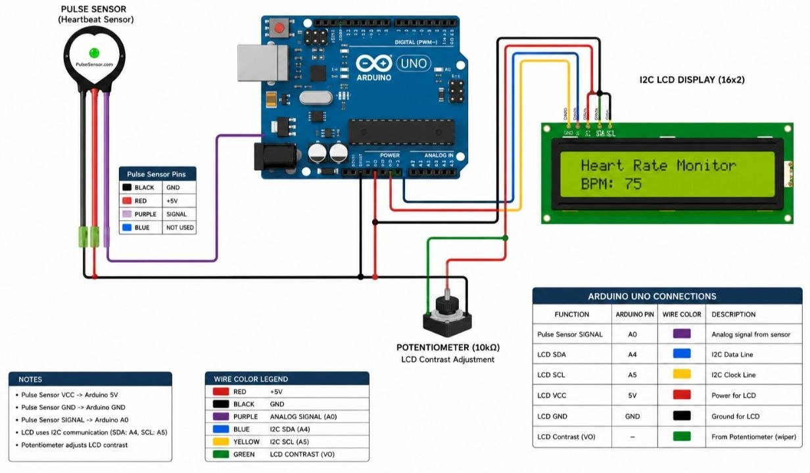
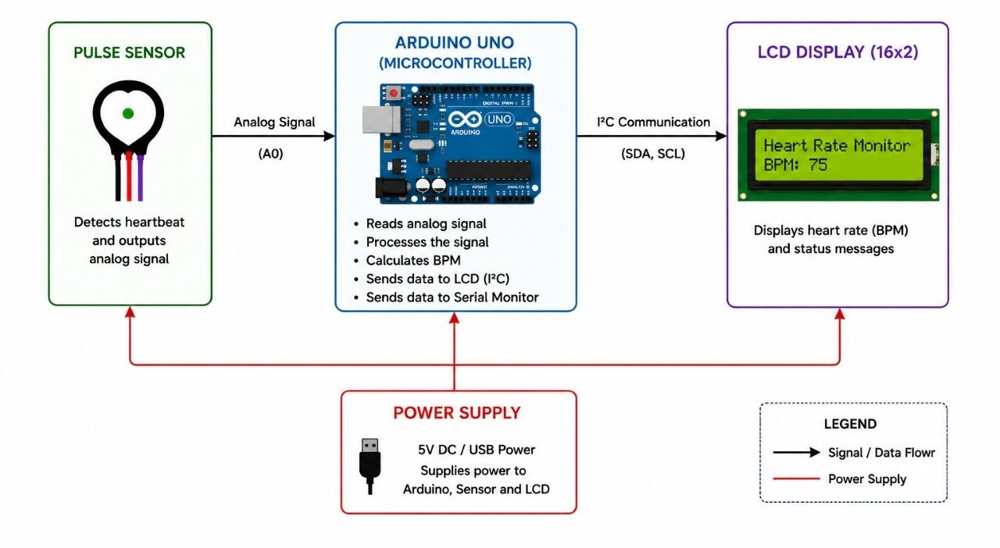
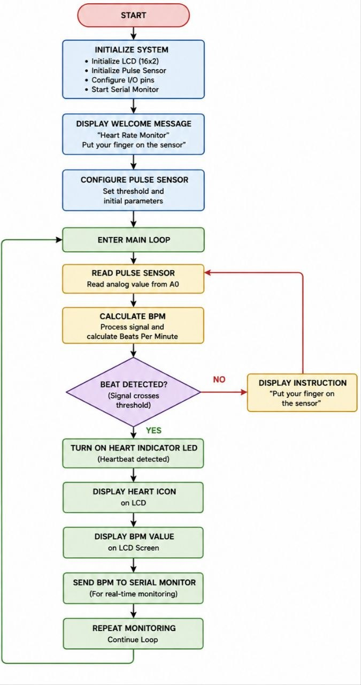

# Heartbeat Monitor Circuit

An Arduino‑based heart rate monitoring system that uses a PulseSensor (or compatible heartbeat sensor) to detect pulse, calculate beats per minute (BPM), and display the heart rate on an LCD screen with a custom animated heart icon. The system also blinks an LED with each heartbeat and outputs BPM to the serial monitor.

## Abstract

This heartbeat monitor circuit is an integral component of medical devices that measure and track a person's heart rate. An Arduino microcontroller communicates with a heartbeat sensor module and displays the heart rate on an LCD screen. The Arduino board interprets the analog output from the heartbeat sensor and converts it into a meaningful heart rate value, shown in real time on the LCD. Doctors can precisely check a patient’s heart rate, helping them identify and monitor heart problems. This gadget is also an excellent introduction to Arduino programming, analog signal processing, and sensor integration.

## Introduction

Heart rate monitoring is essential for assessing cardiovascular health. Monitoring heart rate is useful in medical situations, for athletes, fitness enthusiasts, and people with specific health issues. This project uses an Arduino microcontroller, a heartbeat sensor module (PulseSensor), and an LCD screen to provide real‑time heart rate measurement. The sensor detects electrical activity in the heart (or changes in blood flow via photoplethysmography) and outputs an analog signal. The Arduino processes the signal, calculates BPM, and displays it on the LCD, with an LED flashing on each heartbeat.

## Schematic – Full Circuit (Fritzing)

The Fritzing schematic shows all connections: the PulseSensor’s signal wire to analog pin A0, VCC to 5V, GND to GND. The LCD is connected in 4‑bit mode using digital pins 12 (RS), 11 (EN), 5 (D4), 4 (D5), 3 (D6), and 2 (D7). An LED on pin 13 blinks with each detected heartbeat. A 1000 Ohm resistor limits current to the LED. The circuit is powered by the Arduino’s 5V output.

## High‑Level Design of Circuit Operation

The high‑level diagram illustrates the flow of data: the heartbeat sensor captures analog signals from the finger (or earlobe). The Arduino reads the analog value, applies a threshold (default 550) to detect each pulse, calculates the time between beats to derive BPM, and then sends the BPM value to the LCD and serial monitor. The LED on pin 13 provides a visual beat indicator.

## Flowchart – Solution Algorithm

The flowchart describes the software logic: after initialisation (setup of LCD, serial, PulseSensor object), the system enters an infinite loop. It continuously checks for a new beat using a function that detects the start of a heartbeat. When a beat is detected, it retrieves the BPM, prints a detection message to serial, displays the BPM on the LCD along with a custom heart icon, and blinks the LED. The LCD also shows instructions (“Put your finger on the sensor”) for the first few seconds.

## Detailed Inputs and Outputs

| Part Name      | Part Number | Digital/Analog | Input/Output | Quantity |
|----------------|-------------|----------------|--------------|----------|
| Microcontroller| Arduino UNO | N/A            | N/A          | 1        |
| Heartbeat sensor| PulseSensor / DS18B20 | Analog | Input | 1 |
| Resistor       | 1000 Ohm    | N/A            | N/A          | 1        |
| LED            | T-1         | Digital        | Output       | 1        |
| LCD 16x2       | N/A         | Digital        | Output       | 1        |

## Conclusion

Heartbeat monitor circuits have transformed how heart rate is recorded and tracked. This Arduino‑based system successfully detects heartbeats, calculates BPM, and displays the result on an LCD with a custom heart animation. It is low‑cost, easy to build, and suitable for medical training, fitness monitoring, and educational purposes. Future improvements could include wireless Bluetooth transmission, data logging, and adding a buzzer for audible beat feedback.

## References

[1] Salles, S., Souza, A., Gutfilen, B., & Oliveira, C. (2018). Development of an Arduino‑Based Heart Rate Monitor. *IEEE Latin America Transactions*, 16(11), 2885‑2890.  
[2] Ahammed, F., Zare, A., & Majumder, S. (2020). A Review of Heart Rate Monitoring Techniques: Applications, Challenges, and Future Directions. *IEEE Reviews in Biomedical Engineering*, 13, 234‑247.  
[3] Patel, S., & Patel, S. R. (2017). Design and Implementation of a Low‑Cost Arduino‑Based ECG Monitoring System. In *2017 International Conference on Data Management, Analytics and Innovation (ICDMAI)* (pp. 59‑63). IEEE.  
[4] Siddique, S., Abo‑Zahhad, M., & Helmy, A. (2019). A Comparative Study of Heart Rate Measurement Techniques and Devices. *IEEE Access*, 7, 57603‑57617.  
[5] Chaubey, D., Pathak, K., & Roy, B. (2019). An Arduino‑Based Wireless Heart Rate Monitoring System. In *2019 International Conference on Recent Innovations in Signal Processing and Embedded Systems (RISE)* (pp. 1‑5). IEEE.
